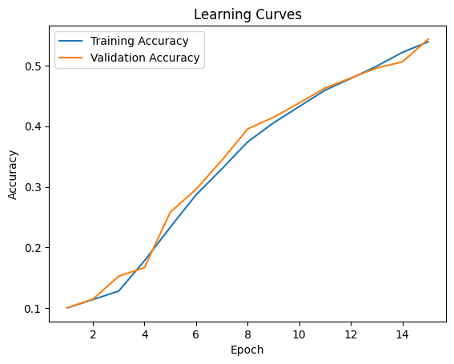
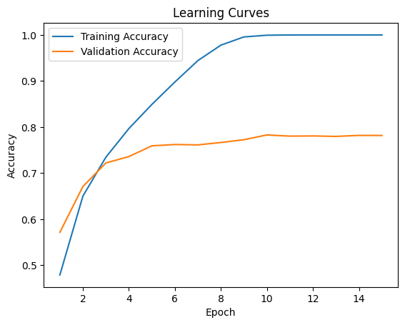
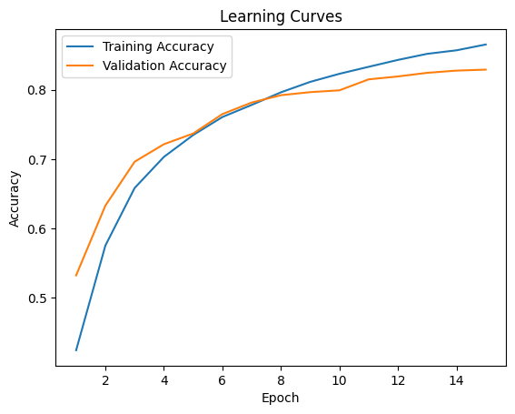

# image-classification
## Motivation:
Classify images and produce learning curves and confusion matrices.

## Data:
I use the [CIFAR 10 Dataset](https://pytorch.org/vision/main/generated/torchvision.datasets.CIFAR10.html), which contains 60,000 labeled color images from 10 different classes - airplanes, cars, birds, cats, deer, dogs, frogs, horses, ships, and trucks. The dataset is balanced, with 6,000 images from each class.

## Initial Design:
When experimenting with architectures, my initial goal was to make my model as deep as possible within a reasonable training run time, because depth would provide an “increasing receptive field”, allowing for smaller kernels/fewer weights to train. I increased the number of kernels in each convolution layer by at least a factor of 2 with each successive layer. I used ReLU activation layers after each convolution, because non-linear layers are crucial for capturing complex patterns. I used Max Pool layers after every other convolution/ReLU pair, in order to subsample the features down to what are intended to be more abstract feature concepts. Finally, I used two fully connected layers with a ReLU activation in between, to translate the abstract features into the desired classes. 

## Results:
The initial design's loss curve is below:   
  

This initial architecture did not achieve a high enough validation accuracy for my liking within the (arbitrarily chosen) 15 epochs, but the run time on my computer was fairly long, so I did not simply want to increase epochs. I researched and learned that Batch Normalization can both speed up learning and act as a sort of regularizer. For these reasons, I added BatchNorm layers after each Max Pool layer.

This second architecture's learning curve showed overfitting, with training accuracy nearing 100%, and validation accuracy hovering around 77% with diminishing returns after about 6 epochs:

  

This indicated to me that the model was not generalizing well. Rather than altering the architecture again, I decided to enhance my training data with random transformations - random flipping and random cropping - in the hopes that this would help the network learn more abstract features for each of the classes, rather than recognizing those features only in certain orientations. 

After performing this training data transformation, the validation accuracy reached about 82%, as shown in the learning curve below:

The final test accuracy was was also 82%.

For full implementation details, see the notebook "image-classification.ipynb" in this repository.